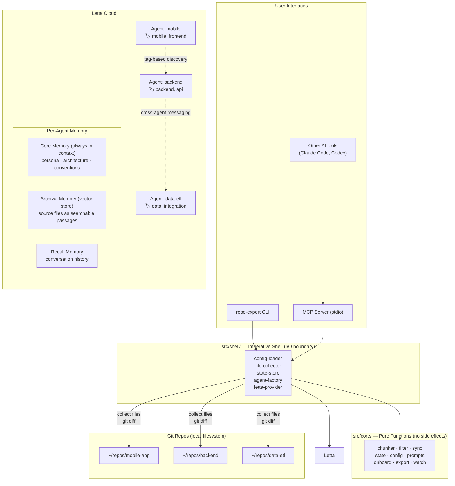

# Repo Expert Agents — Architecture Overview

A CLI framework that creates **persistent AI agents** (on Letta Cloud) that act as long-term memory for git repositories. Unlike IDE tools that forget between sessions, these agents accumulate and refine knowledge over time.

---

## Architecture Diagram



---

## Data Flow

```
 ┌──────────────────────────────────────────────────────────────────┐
 │                         LIFECYCLE                                │
 │                                                                  │
 │  config.yaml          setup              Letta Cloud             │
 │  ┌──────────┐    ┌─────────────┐    ┌─────────────────────┐     │
 │  │ repos:   │───▶│ collect     │───▶│  Agent per repo     │     │
 │  │  mobile  │    │ files       │    │  ┌───────────────┐  │     │
 │  │  backend │    │ chunk ~2KB  │    │  │ Core Memory   │  │     │
 │  │  etl     │    │ load as     │    │  │ (self-updated)│  │     │
 │  └──────────┘    │ passages    │    │  ├───────────────┤  │     │
 │                  │ bootstrap   │    │  │ Archival Mem  │  │     │
 │                  └─────────────┘    │  │ (vector store)│  │     │
 │                                     │  ├───────────────┤  │     │
 │       sync (git diff)               │  │ Recall Memory │  │     │
 │  ┌─────────────────┐                │  │ (conv history)│  │     │
 │  │ detect changed  │───▶ delete old │  └───────────────┘  │     │
 │  │ files since     │    passages,   │                     │     │
 │  │ last commit     │    insert new  └─────────────────────┘     │
 │  └─────────────────┘                                            │
 │                                                                  │
 │       ask                                                        │
 │  ┌─────────────────┐     ┌─────────────────┐                    │
 │  │ "How does auth  │────▶│ Agent searches   │──▶ answer         │
 │  │  work?"         │     │ archival + core  │                    │
 │  └─────────────────┘     │ memory, reasons  │                    │
 │                          └─────────────────┘                    │
 │       ask --all                                                  │
 │  ┌─────────────────┐     ┌──────┐ ┌──────┐ ┌──────┐            │
 │  │ "What's the API │────▶│ A    │ │ B    │ │ C    │ fan-out    │
 │  │  contract?"     │     │      │ │      │ │      │            │
 │  └─────────────────┘     └──┬───┘ └──┬───┘ └──┬───┘            │
 │                             └────┬────┘────────┘                │
 │                                  ▼                               │
 │                          combined answers                        │
 └──────────────────────────────────────────────────────────────────┘
```

---

## CLI Commands

```
repo-expert
 ├── setup [--repo]       Create agents, load files, bootstrap
 ├── ask <repo> <q>       Query a single agent
 │   ├── --all            Broadcast to all agents
 │   └── -i               Interactive REPL
 ├── sync [--full]        Incremental sync via git diff
 ├── watch                Poll git HEAD, auto-sync on new commits
 ├── list                 Show agents and passage counts
 ├── status               Memory stats and health per agent
 ├── export               Dump agent memory to markdown
 ├── onboard <repo>       Guided codebase walkthrough
 └── destroy [--repo]     Delete agents from Letta Cloud
```

---

## Key Design Decisions

- **Functional core, imperative shell** — `src/core/` has pure functions (no I/O), `src/shell/` handles all side effects
- **Provider abstraction** — `AgentProvider` interface decouples from Letta SDK; `LettaProvider` is the current adapter
- **Three-tier memory** — core (always in context, self-updating), archival (vector-searchable source), recall (conversation history)
- **Tag-based discovery** — agents find each other via `["repo-expert", ...tags]`, no hardcoded IDs
- **Incremental sync** — `git diff` detects changes, only affected passages are re-indexed
- **Config-driven** — YAML config defines repos, one `setup` command creates everything
