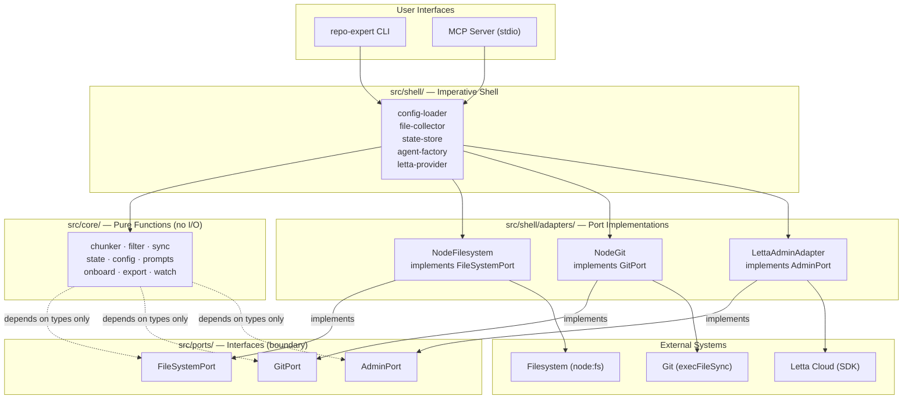

# Repo Expert Agents — Architecture Overview

A CLI framework that creates **persistent AI agents** (on Letta Cloud) that act as long-term memory for git repositories. Unlike IDE tools that forget between sessions, these agents accumulate and refine knowledge over time.

---

## Hexagonal Architecture: Functional Core, Imperative Shell

The codebase follows the **Ports and Adapters** (hexagonal) pattern:

- **Core** (`src/core/`) — pure functions with no side effects; the domain logic
- **Ports** (`src/ports/`) — TypeScript interfaces that define what the core needs from the outside world
- **Shell / Adapters** (`src/shell/`, `src/shell/adapters/`) — concrete implementations of ports; all I/O lives here



---

## Layer Rules

### `src/core/` — Pure Functions

- **Can import**: other `../core/*` modules, `zod/v4`, standard type-only utilities
- **Cannot import**: `../shell/*`, `../ports/*` (implementations), `node:fs`, `node:child_process`, `fast-glob`, or any module with I/O side effects
- Every function must be deterministic: same inputs always produce the same outputs
- No `console.log`, no network calls, no filesystem access

### `src/ports/` — Interfaces Only

- **Contains**: TypeScript `interface` and `type` declarations only
- **Cannot contain**: `class` declarations, function implementations, any runtime code
- These files define the contract between core and the outside world

### `src/shell/` and `src/shell/adapters/` — Imperative Shell

- **Can import**: anything — core, ports, Node.js built-ins, third-party SDKs
- Adapters implement port interfaces and translate between the domain and external APIs
- All side effects (filesystem, network, environment variables, process spawning) live here

---

## Enforcement

Architecture rules are enforced at two levels:

1. **Compile-time (ESLint)** — `eslint.config.mjs` has a `no-restricted-imports` rule on `src/core/**/*.ts` blocking imports of `../shell/*`, `node:fs*`, and `node:child_process`
2. **Test-time (Vitest)** — `src/__tests__/architecture.test.ts` uses `node:fs` to scan source files and assert no violations exist

Run both checks before merging:

```bash
pnpm lint   # ESLint catches violations at the import level
pnpm test   # architecture.test.ts catches violations at the file content level
```

---

## Key Files

| Concept | File |
|---|---|
| Port: filesystem | `src/ports/filesystem.ts` |
| Port: git | `src/ports/git.ts` |
| Port: admin (Letta) | `src/ports/admin.ts` |
| Adapter: filesystem | `src/shell/adapters/node-filesystem.ts` |
| Adapter: git | `src/shell/adapters/node-git.ts` |
| Adapter: admin | `src/shell/adapters/letta-admin-adapter.ts` |
| Shell provider | `src/shell/provider.ts` |
| Architecture tests | `src/__tests__/architecture.test.ts` |

---

## Data Flow

```
 ┌──────────────────────────────────────────────────────────────────┐
 │                         LIFECYCLE                                │
 │                                                                  │
 │  config.yaml          setup              Letta Cloud             │
 │  ┌──────────┐    ┌─────────────┐    ┌─────────────────────┐     │
 │  │ repos:   │───▶│ collect     │───▶│  Agent per repo     │     │
 │  │  mobile  │    │ files       │    │  ┌───────────────┐  │     │
 │  │  backend │    │ chunk ~2KB  │    │  │ Core Memory   │  │     │
 │  │  etl     │    │ load as     │    │  │ (self-updated)│  │     │
 │  └──────────┘    │ passages    │    │  ├───────────────┤  │     │
 │                  │ bootstrap   │    │  │ Archival Mem  │  │     │
 │                  └─────────────┘    │  │ (vector store)│  │     │
 │                                     │  ├───────────────┤  │     │
 │       sync (git diff)               │  │ Recall Memory │  │     │
 │  ┌─────────────────┐                │  │ (conv history)│  │     │
 │  │ detect changed  │───▶ delete old │  └───────────────┘  │     │
 │  │ files since     │    passages,   │                     │     │
 │  │ last commit     │    insert new  └─────────────────────┘     │
 │  └─────────────────┘                                            │
 └──────────────────────────────────────────────────────────────────┘
```

---

## CLI Commands

```
repo-expert
 ├── setup [--repo]       Create agents, load files, bootstrap
 ├── ask <repo> <q>       Query a single agent
 │   └── --all            Broadcast to all agents
 ├── sync [--full]        Incremental sync via git diff
 ├── reconcile [--fix]    Compare local state vs Letta, detect/fix drift
 ├── watch                Poll git HEAD, auto-sync on new commits
 ├── list                 Show agents and passage counts
 ├── status               Memory stats and health per agent
 ├── export               Dump agent memory to markdown
 ├── onboard <repo>       Guided codebase walkthrough
 └── destroy [--repo]     Delete agents from Letta Cloud
```
