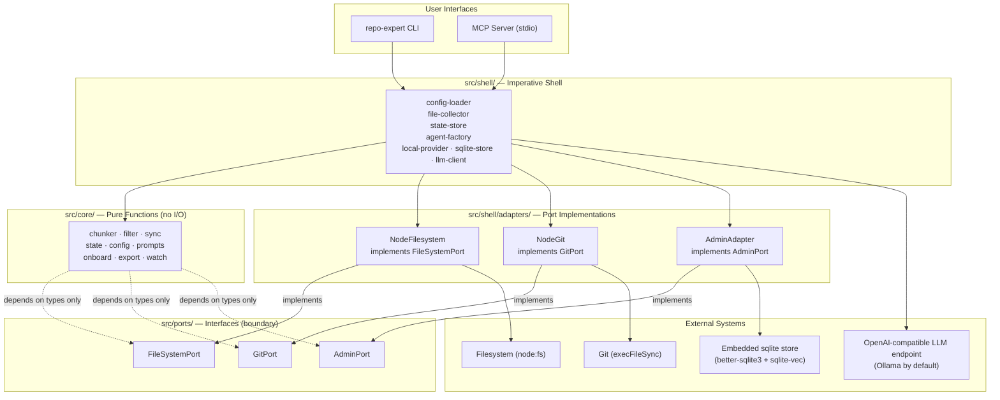

# Repo Expert Agents — Architecture Overview

A CLI framework that creates **persistent AI agents** (an embedded sqlite-vec store for storage/retrieval + any OpenAI-compatible chat endpoint, defaulting to local Ollama) that act as long-term memory for git repositories. Unlike IDE tools that forget between sessions, these agents accumulate and refine knowledge over time.

---

## Hexagonal Architecture: Functional Core, Imperative Shell

The codebase follows the **Ports and Adapters** (hexagonal) pattern:

- **Core** (`src/core/`) — pure functions with no side effects; the domain logic
- **Ports** (`src/ports/`) — TypeScript interfaces that define what the core needs from the outside world
- **Shell / Adapters** (`src/shell/`, `src/shell/adapters/`) — concrete implementations of ports; all I/O lives here


```mermaid
graph TB
    subgraph "External Systems"
        FS["Filesystem (node:fs)"]
        GIT["Git (execFileSync)"]
        SQLITE["Embedded sqlite store\n(better-sqlite3 + sqlite-vec)"]
        LLM["OpenAI-compatible LLM endpoint\n(Ollama by default)"]
    end

    subgraph "src/shell/adapters/ — Port Implementations"
        NFS["NodeFilesystem\nimplements FileSystemPort"]
        NGIT["NodeGit\nimplements GitPort"]
        VAA["AdminAdapter\nimplements AdminPort"]
    end

    subgraph "src/ports/ — Interfaces (boundary)"
        FP["FileSystemPort"]
        GP["GitPort"]
        AP["AdminPort"]
    end

    subgraph "src/core/ — Pure Functions (no I/O)"
        CORE["chunker · filter · sync\nstate · config · prompts\nonboard · export · watch"]
    end

    subgraph "src/shell/ — Imperative Shell"
        SHELL["config-loader\nfile-collector\nstate-store\nagent-factory\nlocal-provider · sqlite-store · llm-client"]
    end

    subgraph "User Interfaces"
        CLI["repo-expert CLI"]
        MCP["MCP Server (stdio)"]
    end

    CLI --> SHELL
    MCP --> SHELL
    SHELL --> CORE
    SHELL --> NFS
    SHELL --> NGIT
    SHELL --> VAA
    NFS -->|implements| FP
    NGIT -->|implements| GP
    VAA -->|implements| AP
    NFS --> FS
    NGIT --> GIT
    VAA --> SQLITE
    SHELL --> LLM
    CORE -.->|depends on types only| FP
    CORE -.->|depends on types only| GP
    CORE -.->|depends on types only| AP
```

---

## Layer Rules

### `src/core/` — Pure Functions

- **Can import**: other `../core/*` modules, `zod/v4`, standard type-only utilities
- **Cannot import**: `../shell/*`, `../ports/*` (implementations), `node:fs`, `node:child_process`, `fast-glob`, or any module with I/O side effects
- Every function must be deterministic: same inputs always produce the same outputs
- No `console.log`, no network calls, no filesystem access

### `src/ports/` — Interfaces Only

- **Contains**: TypeScript `interface` and `type` declarations only
- **Cannot contain**: `class` declarations, function implementations, any runtime code
- These files define the contract between core and the outside world

### `src/shell/` and `src/shell/adapters/` — Imperative Shell

- **Can import**: anything — core, ports, Node.js built-ins, third-party SDKs
- Adapters implement port interfaces and translate between the domain and external APIs
- All side effects (filesystem, network, environment variables, process spawning) live here

---

## Enforcement

Architecture rules are enforced at two levels:

1. **Compile-time (ESLint)** — `eslint.config.mjs` has a `no-restricted-imports` rule on `src/core/**/*.ts` blocking imports of `../shell/*`, `node:fs*`, and `node:child_process`
2. **Test-time (Vitest)** — `src/__tests__/architecture.test.ts` uses `node:fs` to scan source files and assert no violations exist

Run both checks before merging:

```bash
pnpm lint   # ESLint catches violations at the import level
pnpm test   # architecture.test.ts catches violations at the file content level
```

---

## Key Files

| Concept | File |
|---|---|
| Port: filesystem | `src/ports/filesystem.ts` |
| Port: git | `src/ports/git.ts` |
| Port: admin | `src/ports/admin.ts` |
| Adapter: filesystem | `src/shell/adapters/node-filesystem.ts` |
| Adapter: git | `src/shell/adapters/node-git.ts` |
| Adapter: admin | `src/shell/adapters/admin-adapter.ts` |
| Provider port | `src/ports/agent-provider.ts` |
| Passage-store port | `src/ports/passage-store.ts` |
| Local provider | `src/shell/local-provider.ts` |
| Sqlite store | `src/shell/sqlite-store.ts` |
| LLM client | `src/shell/llm-client.ts` |
| Tree-sitter chunker | `src/core/tree-sitter-chunker.ts` |
| Symbol index / refs | `src/core/symbol-index.ts`, `src/core/symbol-refs.ts`, `src/core/tree-sitter-refs-js.ts` |
| Symbol graph / PageRank | `src/core/symbol-graph.ts`, `src/core/symbol-pagerank.ts`, `src/core/symbol-store.ts` |
| Agentic ask tools | `src/shell/agent-tools.ts`, `src/shell/repo-tools.ts`, `src/shell/symbol-lookup.ts` |
| Content-hash sync skip | `src/core/content-hash.ts`, `src/shell/sync.ts` |
| Architecture tests | `src/__tests__/architecture.test.ts` |

---

## Data Flow

```
 ┌──────────────────────────────────────────────────────────────────┐
 │                         LIFECYCLE                                │
 │                                                                  │
 │  config.yaml          setup           sqlite store + LLM endpoint │
 │  ┌──────────┐    ┌─────────────┐    ┌─────────────────────┐     │
 │  │ repos:   │───▶│ collect     │───▶│  Agent per repo     │     │
 │  │  mobile  │    │ files       │    │  ┌───────────────┐  │     │
 │  │  backend │    │ chunk       │    │  │ Core Memory   │  │     │
 │  │  etl     │    │ (raw/       │    │  │ (self-updated)│  │     │
 │  └──────────┘    │ tree-sitter)│    │  ├───────────────┤  │     │
 │                  │ load as     │    │  │ Archival Mem  │  │     │
 │                  │ passages    │    │  │ (vector store)│  │     │
 │                  │ bootstrap   │    │  ├───────────────┤  │     │
 │                  └─────────────┘    │  │ Recall Memory │  │     │
 │  ┌─────────────────┐                │  │ (conv history)│  │     │
 │  │ detect changed  │───▶ delete old │  └───────────────┘  │     │
 │  │ files since     │    passages,   │                     │     │
 │  │ last commit     │    insert new  └─────────────────────┘     │
 │  └─────────────────┘                                            │
 └──────────────────────────────────────────────────────────────────┘
```

**Hybrid retrieval**: archival-memory search (`SqlitePassageStore.semanticSearch`) fuses two legs. The vector leg is cosine similarity over sqlite-vec embeddings; the lexical leg is BM25 over an FTS5 external-content index on passage text (`tokenize="unicode61 tokenchars '_'"`, so `snake_case` identifiers stay whole), kept in sync by SQLite triggers on every write path and backfilled via FTS5 `'rebuild'` when a pre-FTS database is opened. Both legs over-fetch (`max(limit * 3, 15)` candidates) and are combined with Reciprocal Rank Fusion (`rrfFuse` in `src/core/hybrid-rank.ts`, k=60); the returned `score` is the fused RRF score, not cosine similarity. Queries are sanitized into quoted OR terms (`toFtsMatchQuery`) so no FTS5 operator syntax reaches `MATCH`; a query with no extractable terms — or any FTS failure, including FTS5 being unavailable at startup — degrades to vector-only search. An optional `pathPrefix` scopes both legs to passages whose `file_path` starts with that prefix (stage-retrieval narrowing).

**Agentic search**: standalone CLI `ask` exposes live-repo tools (`grep_repo`, `glob_files`, `read_file`, `find_symbol`) alongside archival recall (`LocalRuntimeOptions.agenticTools`). MCP / coding-harness `agent_call` leaves those off — the host already has filesystem tools — and keeps memory + hybrid recall only (no MCP symbol/filesystem tools). Path safety lives in `src/core/repo-path.ts`; ripgrep argv building in `src/core/ripgrep-args.ts`; handlers in `src/shell/repo-tools.ts` / `src/shell/agent-tools.ts`. Persisted persona stays harness-friendly; CLI ask appends ephemeral live-tool guidance.

**Incremental sync**: git-diff (or fs.watch) still selects candidate files; `syncRepo` additionally skips re-chunk/re-embed when `AgentState.fileHashes` matches the current content SHA-256 (`src/core/content-hash.ts`). The same hash gate refreshes or drops `AgentState.symbolFiles` (defs + refs) and recomputes `symbolRanks` (PageRank) when content changes.

The chunk step uses **tree-sitter** symbol-boundary chunking for `.ts`/`.mts`/`.cts`/`.tsx`/`.js`/`.jsx`/`.mjs`/`.cjs`/`.py`/`.go`/`.java`/`.rb`/`.rs`/`.php`/`.c`/`.h`/`.cpp`/`.hpp`/`.cs`/`.kt`/`.kts`/`.swift`; other file types automatically fall back to ~2KB raw text splits on paragraph boundaries. Implementation lives in `src/core/tree-sitter-chunker.ts` (per-language extractors in `src/core/tree-sitter-lang-*.ts`).

**Symbol references (TS/JS):** alongside definition spans, `extractSymbolRefsFromFile` / `extractSymbolRefsJsTs` (`src/core/symbol-refs.ts`, `src/core/tree-sitter-refs-js.ts`) pull import, export, and call-site refs from the same grammars.

**Repo-map ranking:** `buildSymbolGraph` (`src/core/symbol-graph.ts`) builds directed import/call edges onto definition nodes (TS/JS + Python/Go refs; tsconfig path aliases via `tsconfig-paths.ts` / `tsconfig-loader.ts`); `pageRank` / `rankDefinitions` score importance. Persisted via `symbol-store.ts`; CLI `find_symbol` returns ranked hits; consolidate prompts include `formatTopSymbolsEvidence`.

**Git-versioned memory (Phase A):** optional `memory.git_versioned` stores blocks as markdown under `memory.dir` (`GitMarkdownBlockStorage`) instead of sqlite blocks. Worktree-isolated consolidate/commit is not yet wired.

**Vendored grammars**: every language above resolves its wasm from the grammar's own npm package (`node_modules/<pkg>/...`) except Kotlin and Swift, whose community grammars (`tree-sitter-kotlin`, `tree-sitter-swift`) ship grammar source but no `.wasm` at all. Those two are checked into `vendor/wasm/` instead, with a `checksums.json` recording their sha256 + provenance (source package, upstream grammar version, build tool). Rebuild/refresh with `pnpm tsx scripts/build-grammar-wasm.ts` — it tries a self-build via `tree-sitter-cli` first (no Docker/Emscripten needed since CLI 0.26), falling back to copying the prebuilt wasm out of the `@lumis-sh/wasm-kotlin`/`@lumis-sh/wasm-swift` npm packages when the CLI build can't run (e.g. a sandboxed environment that blocks the WASI SDK download). `src/shell/tree-sitter-paths.ts`'s `GRAMMAR_PACKAGE_INFO` table drives both resolution paths and the SEA wasm-manifest, so a new vendored grammar only needs an entry there.

---

## CLI Commands

```
repo-expert
 ├── setup [--repo]       Create agents, load files, bootstrap
 ├── ask <repo> <q>       Query a single agent
 │   └── --all            Broadcast to all agents
 ├── sync [--full]        Incremental sync via git diff
 ├── reconcile [--fix]    Compare local state vs the provider, detect/fix drift
 ├── watch                Poll git HEAD, auto-sync on new commits
 ├── list                 Show agents and passage counts
 ├── status               Memory stats and health per agent
 ├── export               Dump agent memory to markdown
 ├── onboard <repo>       Guided codebase walkthrough
 └── destroy [--repo]     Delete agents
```
